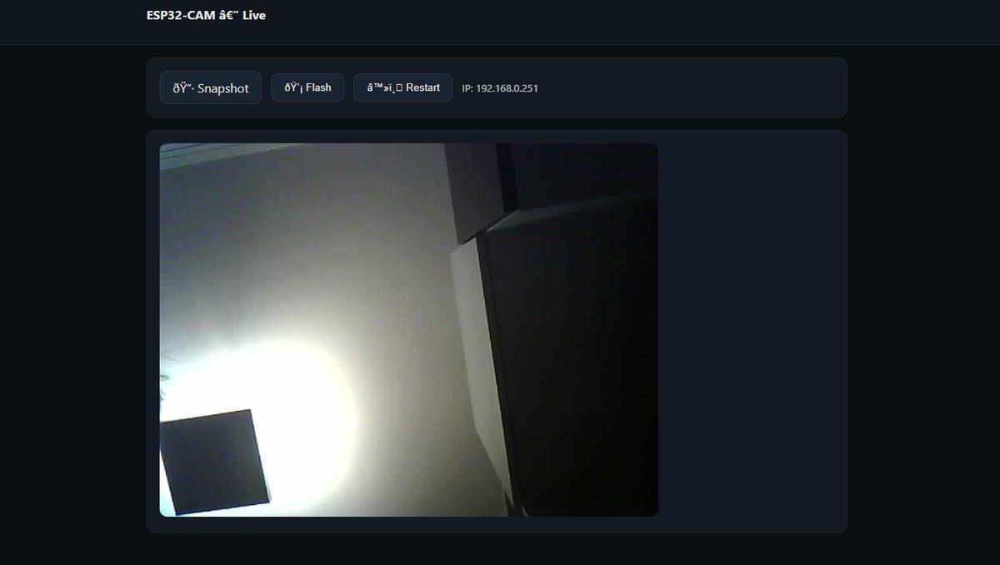

# ESP32‑CAM WROVER — Web Streaming Server 


> Projeto de teste e validação do **ESP32‑CAM (AI‑Thinker/OV2640)** com **servidor HTTP embutido**, streaming MJPEG em `/stream`, captura de imagem em `/jpg`, controle do **flash on‑board** e página web minimalista responsiva. O foco é **estabilidade**, **baixo consumo de RAM** e uma arquitetura simples de depurar.

<p align="center">
  
</p>

---

## Destaques do projeto

- **Streaming MJPEG** contínuo (rota `/stream`) com _boundary_ multipart e **alívio de watchdog/TCP** entre quadros.
- **Snapshot instantâneo** (rota `/jpg`) direto do framebuffer (JPEG).
- **UI embutida** (rota `/`) com botões de *Snapshot*, *Flash* e *Restart*.
- **Controle de flash** por HTTP: `/flash?onoff=on|off|toggle`.
- **Gestão de concorrência**: uma sessão de streaming por vez (`503 Busy`) para evitar esgotamento de RAM.
- **Perfil conservador de memória**: `FRAMESIZE_VGA`, `jpeg_quality=15`, `fb_count=1`, framebuffer em **PSRAM** quando disponível.
- **Telemetria periódica de memória** no Serial (`[MEM] DRAM=... PSRAM=...`).

---

## Hardware utilizado

| Componente | Detalhes |
|---|---|
| **ESP32‑CAM AI‑Thinker** | ESP32 + sensor **OV2640**, flash LED on‑board (GPIO4), conector FFC da câmera, PSRAM integrado |
| **Módulo de extensão (ESP32‑CAM‑MB)** | Interface USB‑C, conversor serial, alimentação estável e headers p/ _auto‑reset_ |
| **Alimentação** | 5V estável (recomendado ≥ 1A). Para uso do flash, prefira fonte/USB tipo C robustos |

<p align="center">
  
  
</p>

---

## Mapa de pinos (AI‑Thinker / OV2640)

| Sinal | GPIO | Sinal | GPIO |
|---|---|---|---|
| `XCLK` | 0 | `PCLK` | 22 |
| `SIOD` | 26 | `VSYNC` | 25 |
| `SIOC` | 27 | `HREF` | 23 |
| `D7 (Y9)` | 35 | `D3 (Y5)` | 21 |
| `D6 (Y8)` | 34 | `D2 (Y4)` | 19 |
| `D5 (Y7)` | 39 | `D1 (Y3)` | 18 |
| `D4 (Y6)` | 36 | `D0 (Y2)` | 5 |
| `PWDN` | 32 | `RESET` | -1 |
| **Flash LED** | **4** | — | — |

> O mapeamento acima corresponde aos `#define` do firmware (AI‑Thinker).

---

## Arquitetura do firmware

```
[Camera Driver (esp32-camera)]
           │
           ▼
[FrameBuffer JPEG] ──► [/jpg] (HTTP GET)
           │
           └──► [Multipart Stream] ──► [/stream] (HTTP GET)
                                   (boundary=frame)
           
[UI HTML/CSS/JS] ──► [/]
[Flash Control]  ──► [/flash?onoff=on|off|toggle]
[Restart]        ──► [/restart]
```

- HTTPD configurado com **`max_open_sockets=2`** e **stack ampliada** para robustez.
- **`streamingBusy`** evita múltiplos clientes consumindo a mesma RAM.
- *Fallback* automático para **modo AP** (SSID dinâmico `ESP32CAM-xxxx`) se o STA não conectar.
- Ajustes finos de sensor (nitidez/cores) e **correção de lente** ativável (`set_lenc`).

---

## Interface Web

<p align="center">
  <br/>
  <em>UI mínima: Snapshot, Flash e Restart — responsiva e clara.</em>
</p>

---

## Decisões técnicas que aumentam a estabilidade

- **Resolução inicial VGA (640×480)**: boa qualidade com baixa pressão em RAM/PSRAM.
- **`jpeg_quality = 15`**: arquivos menores e transmissão fluida em redes comuns.
- **`fb_count = 1`**: elimina filas longas de quadros e reduz latência.
- **`CAMERA_GRAB_LATEST`**: sempre envia o quadro mais recente → sensação de tempo real.
- **Delays curtos (5–10 ms)** no loop de streaming: alívio do watchdog e da pilha TCP/IP.
- **Registro periódico de memória**: facilita diagnóstico de vazamento/pressão de heap.

---

## Endpoints expostos

- `GET /` → página HTML responsiva com controles
- `GET /jpg` → captura única (MIME `image/jpeg`)
- `GET /stream` → streaming MJPEG (`multipart/x-mixed-replace`)
- `GET /flash?onoff=on|off|toggle` → controla o LED do flash (**GPIO 4**)
- `GET /restart` → reinicia o módulo

> Em ambientes de produção, considere autenticar/desabilitar `/restart` e `/flash`.

---

## Trechos relevantes do firmware (credenciais ofuscadas)

```cpp
// Wi-Fi
const char* WIFI_SSID = "SEU_SSID";
const char* WIFI_PASS = "SUA_SENHA";

// Perfil de câmera focado em estabilidade
config.frame_size   = FRAMESIZE_VGA;
config.jpeg_quality = 15;
config.fb_count     = 1;
config.fb_location  = psramFound() ? CAMERA_FB_IN_PSRAM : CAMERA_FB_IN_DRAM;

// HTTPD
config.server_port = 80;
config.max_open_sockets = 2;
config.stack_size = 8192;
```
> **Nunca** versione senhas reais. Prefira variáveis de ambiente, `secrets.h` ou `.gitignore`.

---

## Dicas de depuração e operação

- **Alimentação**: quedas de tensão causam travamentos/brownout. Use USB/fonte 5V ≥ 1A.
- **Boot em modo download** (log mostra `DOWNLOAD_BOOT`): verifique **GPIO0** e o adaptador MB.
- **Foco e orientação**: ajuste a lente e, se necessário, aplique `s->set_vflip(s,1)` / `s->set_hmirror(s,1)`.
- **Erro `camera init fail`**: confirme o mapeamento de pinos, a fita FFC da câmera e a presença de PSRAM.
- **Wi‑Fi 2.4 GHz** apenas; desative *Power Save* (`WiFi.setSleep(false)`).
- **Uma sessão por vez**: o servidor responde `503 Busy` se já houver um streaming ativo.
- **LED Flash** muito forte? Considere PWM (LEDC) para *dimming* ou limitar tempo de uso.

---

## Segurança (boas práticas rápidas)

- Não exponha o endpoint ao público sem **firewall/NAT**.
- Avalie **HTTP Basic Auth** ou *token* simples nas rotas sensíveis.
- Isole a rede do laboratório e troque credenciais padrão.
- Se necessário, coloque o dispositivo atrás de um **proxy** (TLS/HTTPS).

---

## Roadmap

- Controles de câmera via UI (exposição, saturação, `framesize`).
- *Auto‑fallback* para resoluções menores quando a RAM estiver crítica.
- **Gravação local** em cartão SD (se presente) ou _upload_ para servidor.
- **Detecção de movimento** e snapshots condicionais.
- RTSP opcional para compatibilidade com softwares de CCTV.

---

## Créditos

- Firmware baseado em **ESP-IDF/Arduino + esp32-camera**.
- Montagem, testes e documentação: **Miguel Gengo**.
- Fotos próprias do hardware (frente, placa MB e montagem).

---

## Licença

Este repositório é disponibilizado sob a **licença MIT** (ou ajuste para a licença de sua preferência).
